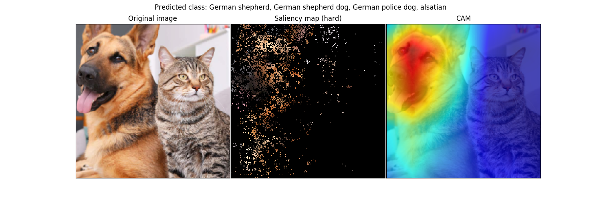
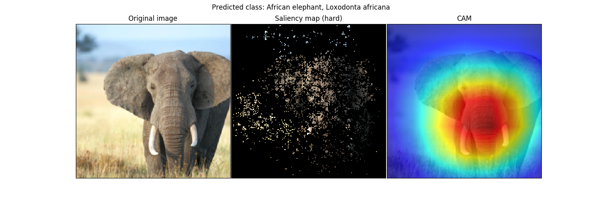
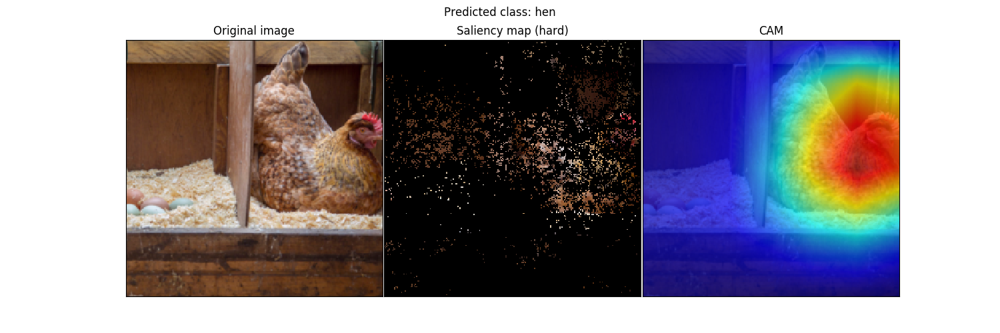

<p align="center">
  
</p>

----

<p align="center">
  
</p>

----

<p align="center">
  
</p>


----  
Papers: 
* <a href="https://arxiv.org/abs/1312.6034"> Deep Inside Convolutional Networks: Visualising Image Classification Models and Saliency Maps </a>
* <a href="http://cnnlocalization.csail.mit.edu/Zhou_Learning_Deep_Features_CVPR_2016_paper.pdf"> Learning Deep Features for Discriminative Localization </a> 
  

## Run
```shell
python main.py
```
